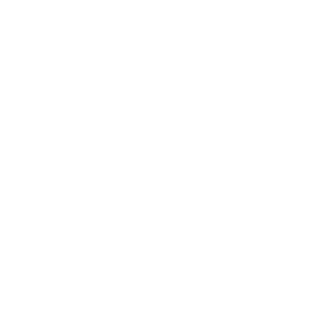

# plugin.program.HexWiz
Fork of "OpenWizard" from a4k-openproject

OpenWizard was created to help the Kodi community out and help get rid of the broken personal wizards that are floating around.
For more information on how to edit/customize this wizard for your own usage, please read [the wiki](https://github.com/drinfernoo/plugin.program.openwizard/wiki).

  <ul>
    OpenWizard was created to help 
	the Kodi community out and help 
	get rid of the broken personal 
	wizards that are floating around.
    For more information on how to 
	edit/customize this wizard for 
	your own usage, please read[the wiki]
	(https://github.com/drinfernoo/plugin.program.openwizard/wiki). 
  </ul>

## Enjoy!